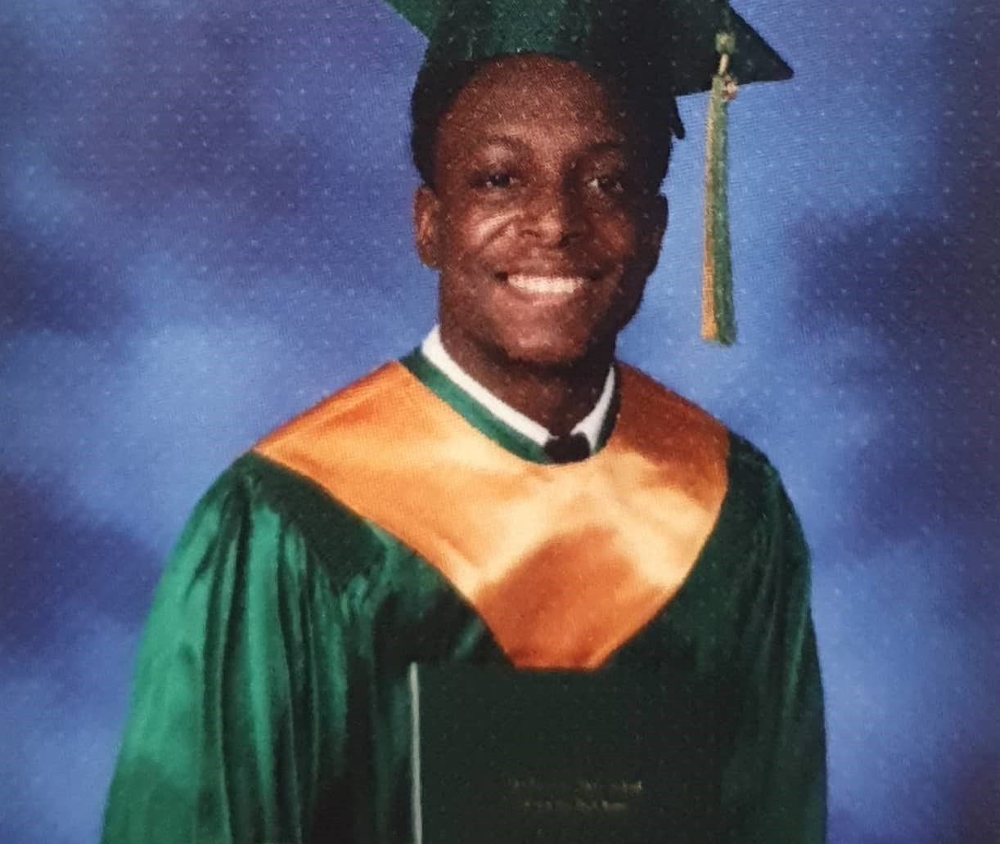

<h1 align="center">Dave Brown</h1>

  <a href="https://whis101.github.io/contacts.html" style="margin: 0 15px;">📫 Contacts</a>
  <a href="https://whis101.github.io/internships.html" style="margin: 0 15px;">💼 Internships</a>
  <a href="https://whis101.github.io/projects.html" style="margin: 0 15px;">🧠 Projects</a>

## ABOUT ME

  
  My name is Dave Brown, and I am a student majoring in Mathematics and Computer Science with a strong passion for solving real-world problems through analytical thinking and programming. I am fascinated by the challenge of taking complex systems apart, understanding how they work, and building solutions that are both elegant and effective. My academic journey has been shaped by a commitment to discipline, focus, and continuous learning, and I am constantly seeking out opportunities to sharpen my skills and deepen my understanding of the subjects I love.

  Alongside my technical interests, I have a deep appreciation for art, which offers a creative balance to the structure and logic of math and programming. I believe that artistic thinking can enhance the way we solve problems by encouraging new perspectives and more flexible approaches. Whether I am writing code, studying abstract concepts, or creating art, I aim to bring curiosity, patience, and intention to everything I do. For me, learning is not just a task; it is a mindset and a lifelong pursuit.

---

### SKILLS

- **Python**  
  Numpy, Pandas, Matplotlib  
- **SQL**  
- **C++**
